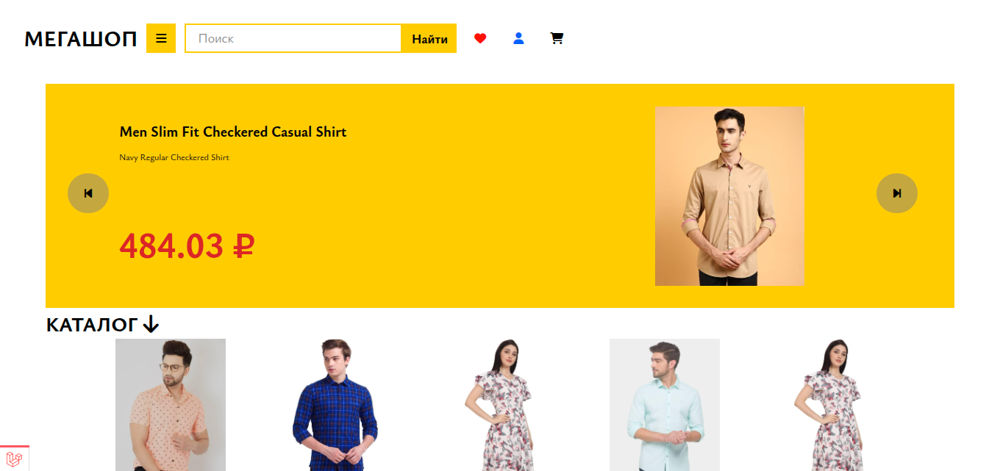
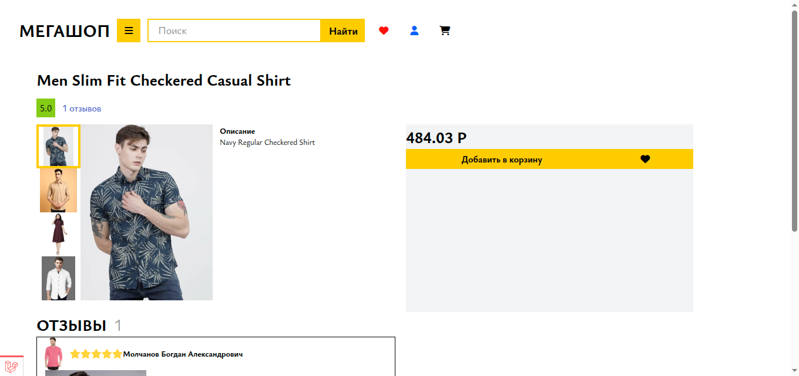
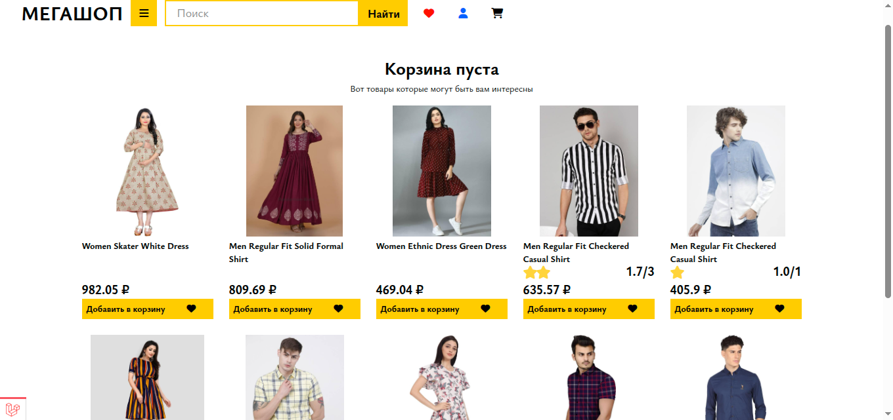
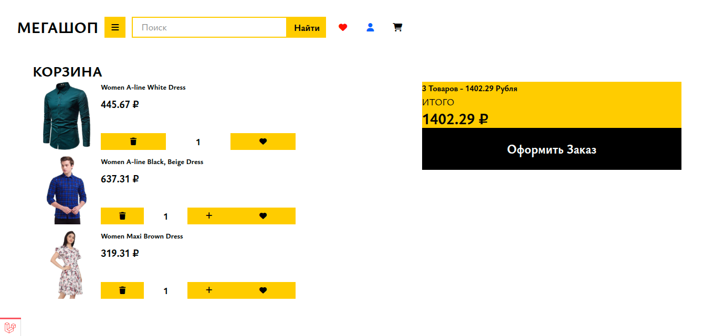
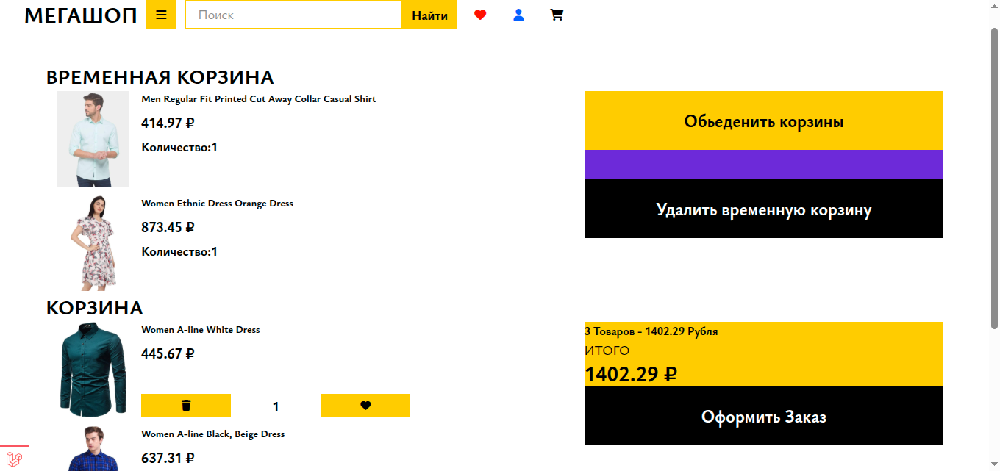
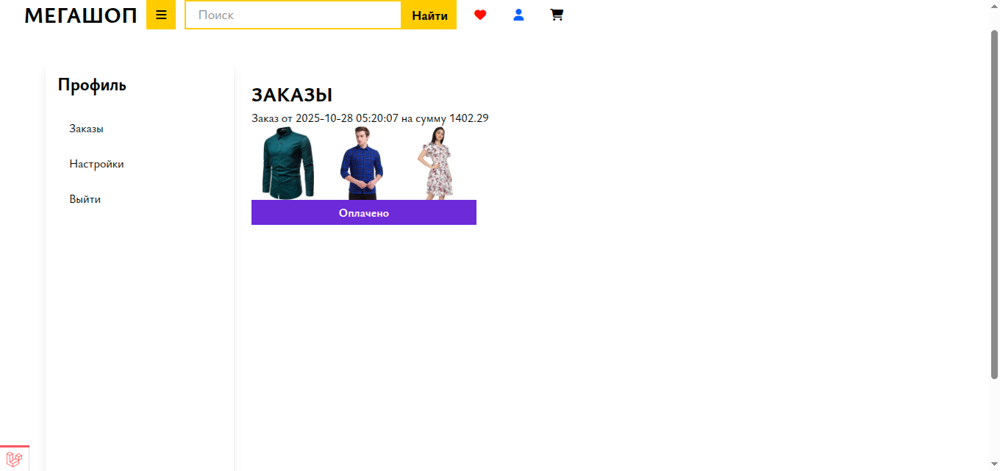
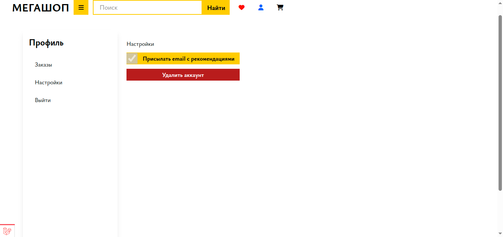
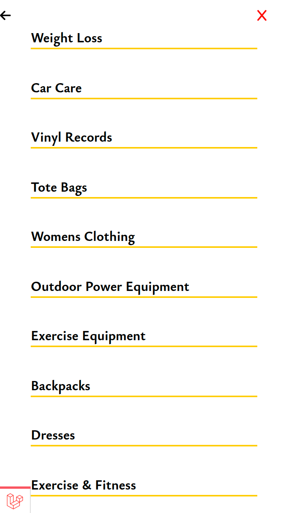
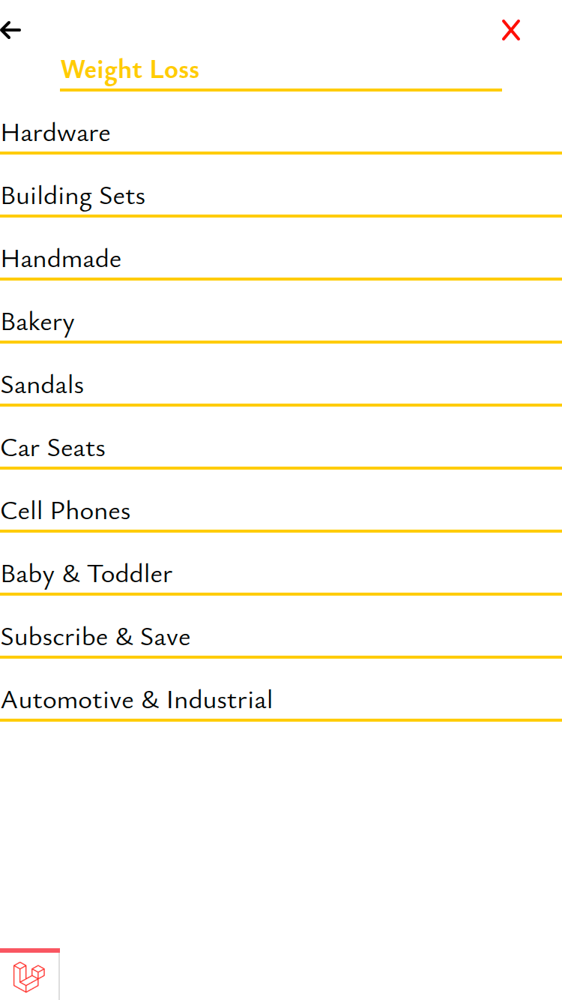
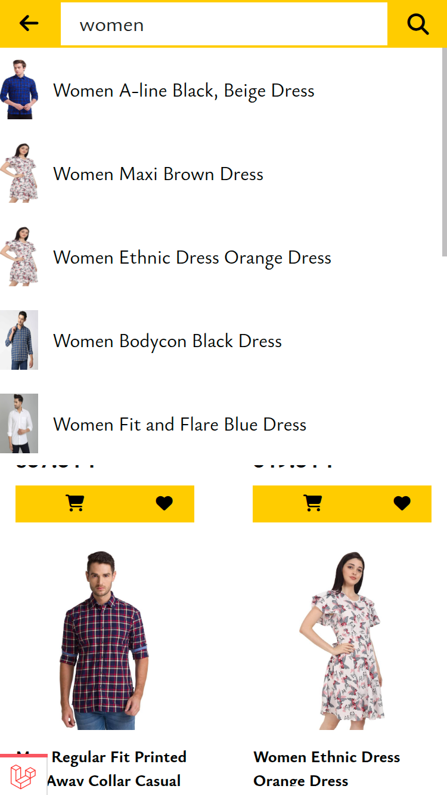

## 🚀 Установка и Запуск Проекта

Для запуска проекта требуется только **Docker** и **Docker Compose**. Все зависимости, окружение и база данных будут подготовлены автоматически.

### 1. Инициализация и Подготовка (Первый Запуск)

Первым шагом является полная инициализация проекта. Используйте профиль `init`, который соберет необходимые образы, загрузит зависимости (Composer/NPM), применит миграции и выполнит заполнение базы данных (сидеры).

```bash
docker compose --profile init up
```

> **Примечание:** Эта команда может занять несколько минут, так как происходит первая сборка образов и установка всех зависимостей.

### 2. Запуск Сервисов

После успешной инициализации вы можете запустить приложение в рабочем режиме, используя профиль `start`.

```bash
docker compose --profile start up
```

Ваше приложение будет доступно по адресу, указанному в конфигурации (обычно `http://localhost`).

---

## 🛠️ Утилиты и Управление Данными

В вашем проекте предусмотрена отдельная команда для генерации контента (баннеров), которую можно запустить в любой момент после инициализации.

### Генерация Тестовых Баннеров

Чтобы сгенерировать набор тестовых баннеров для работы приложения, используйте следующую команду. Команда запускается через сервис `scheduler` и выполняет Artisan-команду.

```bash
docker compose run --rm scheduler php artisan app:generate-banners
```

> **Важно:** Сгенерированные баннеры станут доступны и будут отображаться при следующем запуске основных сервисов (командой `docker compose --profile start up`).

---


## 💡 Обзор Проекта

Этот проект представляет собой прототип минималистичного **онлайн-магазина (e-commerce shop)**, спроектированного для демонстрации полного цикла разработки: от построения кастомного UI/UX до создания сложной многоконтейнерной инфраструктуры.


## 🛠️ Технологический Стек и Архитектура

Проект построен на современном стеке технологий с акцентом на производительность и модульность.

### Backend

| Технология | Описание |
| :--- | :--- |
| **Laravel** | Мощный PHP-фреймворк, используемый для создания надежного API, бизнес-логики и управления данными. |
| **Docker Environment** | Использование 9 контейнеров для изоляции сервисов (Web Server, PHP-FPM, Database, Scheduler и т.д.). |
| **Многослойная Сборка** | Применение многослойной (multi-stage) сборки Docker-образов для оптимизации размера конечных образов и ускорения CI/CD процессов. |

### Frontend

| Технология | Описание |
| :--- | :--- |
| **Vanilla JavaScript** | Чистый, нативный JavaScript для максимальной производительности и контроля над DOM. |
| **Кастомный Компонентный Фреймворк** | Разработан минимальный компонентный фреймворк для структурирования фронтенда. Этот подход обеспечивает: |
| | — **Высокую свободу:** Позволяет легко адаптировать и контролировать поведение каждого компонента без лишних абстракций. |
| | — **Простоту и легковесность:** Отсутствие большого накладного расхода, характерного для крупных фреймворков. |
| **Tailwind CSS** | Применен собственный дизайн, реализованный с помощью utility-first фреймворка Tailwind CSS, что гарантирует чистый и адаптивный пользовательский интерфейс. |

---

## 💻 Функциональные Особенности и UX/UI

Проект реализован с акцентом на интуитивно понятный пользовательский интерфейс и полную адаптивность, что критически важно для современного e-commerce.

### Ключевой Функционал Магазина:

1.  **Каталог и Просмотр Товаров:** Отображение списка товаров с возможностью детального просмотра.
2.  **Детальная Страница Продукта:** Включает информацию о товаре, оценку (рейтинг, количество отзывов) и **виджет галереи изображений** с превью.
3.  **Система Поиска:** Быстрый поиск по названию товаров с предпросмотром результатов.

### Особенности Мобильного Пользовательского Опыта:

Особое внимание уделено адаптивности (mobile-first approach).

*   **Адаптивный Поиск:** Полноэкранный, оптимизированный для мобильных устройств интерфейс поиска.
*   **Многоуровневая Навигация (Гамбургер-меню):** Реализована сложная, **многоуровневая структура категорий**, доступная через мобильное меню. Это обеспечивает легкую навигацию по большой номенклатуре товаров, даже на маленьких экранах.


## ⚙️ Функциональные Особенности и Сложная Бизнес-Логика (Backend)

Этот раздел демонстрирует реализацию критически важных для e-commerce процессов, требующих управления состоянием и транзакциями.

### Управление Заказами и Корзиной

*   **Корзина (Cart Persistence):** Реализованы две концепции корзины:
    *   **Временная корзина (Guest Cart):** Используется для анонимных пользователей (хранится, например, в сессии).
    *   **Перманентная корзина (User Cart):** Привязывается к авторизованному пользователю и хранится в базе данных.
*   **Объединение Корзин:** При авторизации пользователя реализована логика объединения: товары из временной корзины могут быть добавлены в перманентную корзину или полностью заменены ею (по выбору пользователя).
*   **Список Избранного (Favorites):** Функционал `Favorite` работает по аналогичной логике: избранные товары сохраняются перманентно для авторизованных пользователей. 
*   **Оформление Заказа (Checkout):** Полный цикл оформления, включая резервацию товара на складе.

### Управление Ресурсами и Тайм-ауты

*   **Резервация Товаров:** При инициировании процесса оформления заказа товар автоматически резервируется.
*   **Тайм-аут Резервации:** Реализована автоматическая отмена резервации и возврат товара на склад, если пользователь не завершил оплату в течение установленного времени (5 минут). Это реализовано с использованием планировщика (`scheduler`).

### Личный Кабинет Пользователя

*   Предоставлен личный кабинет, где пользователь может просматривать историю заказов, их текущий статус и повторно инициировать оплату незавершенных транзакций.

### Наполнение Данными

*   **Сидеры (Seeders):** Проект включает полноценные сидеры, которые наполняют базу данных высококачественными, приближенными к реальности данными (товары, категории, пользователи, отзывы), позволяя сразу же протестировать все функции.


## 🚧 Извлеченные Уроки и Управление Проектом

Разработка данного проекта стала важным опытом в управлении амбициями и техническим долгом, демонстрируя способность к приоритизации и рефакторингу.

### Амбиции и Рефакторинг

Первоначальные архитектурные решения были избыточны и привели к усложнению разработки (так называемый "небоскрёб из-за начальных решений"). Ключевые сложности включали:

*   **Преодоление "Стены" Небоскрёба:** Столкнувшись с чрезмерной сложностью, было принято решение о **приоритизации и рефакторинге**.
*   **Сведение Скоупа (Scope Management):** Проект был сознательно сведен до текущего функционала (MVP — Minimum Viable Product), чтобы обеспечить его полную работоспособность, стабильность и завершенность.

> **Результат:** Проект, несмотря на первоначальные сложности, был успешно доведен до рабочего состояния, демонстрируя не только технические навыки, но и умение принимать решения о скоупе, рефакторить и фокусироваться на конечном результате.

---

### Скриншоты













